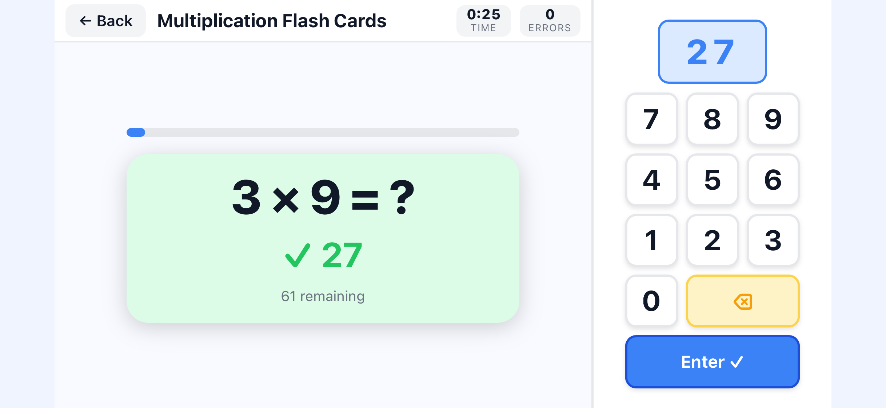
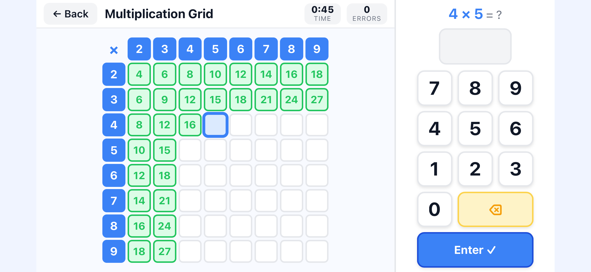

# Math Facts Game

A mobile-first math practice game for kids, installable as a PWA. Covers multiplication, division, factors, and equivalence (fractions, decimals, percentages).

**[Play it live →](https://d3tcg06jc3xgmz.cloudfront.net)**

## Screenshots

<p align="center">
  
  
  
</p>
<p align="center">
  
</p>

## Games

| # | Name | Description |
|---|------|-------------|
| 1 | Multiplication Grid | Fill in a 9×9 times-table grid against the clock |
| 2 | Factor Hunt | Given a product, tap all its factor pairs |
| 3 | Factor Hunt (Auto) | Same as Factor Hunt, but the factor is auto-selected |
| 4 | Multiplication Flash Cards | Classic timed flash cards for multiplication |
| 5 | Division Flash Cards | Classic timed flash cards for division |

Each game tracks time and errors, and shows a results screen on completion.

## Architecture

Everything is a single self-contained file: **`index.html`** (~70 KB). There is no build step, no framework, no dependencies beyond a bundled copy of `html2canvas` for screenshot sharing.

```
index.html        — all HTML, CSS, and game logic
sw.js             — service worker (cache-first, offline support)
manifest.json     — PWA manifest (name, icons, display mode)
icon-*.png        — PWA home screen icons (180, 192, 512px)
```

The service worker caches all static assets on first load, so the game works fully offline after the first visit. Bump `CACHE_VERSION` in `sw.js` whenever you deploy a new version to force clients to refetch.

### Hosting

Deployed as a static site on **AWS S3 + CloudFront**:

- S3 bucket serves the static files
- CloudFront provides HTTPS, CDN caching, and security headers (HSTS, X-Frame-Options, CSP, etc.)
- `deploy.sh` handles uploads and issues a `/*` cache invalidation on each deploy

## Deploying

**Prerequisites:** AWS CLI configured with credentials that have `s3:PutObject` and `cloudfront:CreateInvalidation` permissions.

1. Copy the environment template and fill in your values:

   ```bash
   cp .env.example .env
   # edit .env with your S3 bucket name, CloudFront distribution ID, and URL
   ```

2. Run the deploy script:

   ```bash
   ./deploy.sh
   ```

   This uploads `index.html` and `sw.js` to S3 and invalidates the CloudFront cache. The new version is live within ~30 seconds.

## Development

No build tools required. Open `index.html` directly in a browser, or serve it locally:

```bash
python3 -m http.server 8080
# open http://localhost:8080
```

The service worker only registers over HTTPS or `localhost`, so local development works without it.
